<p align="center">
  <a href="https://neonvale.dev">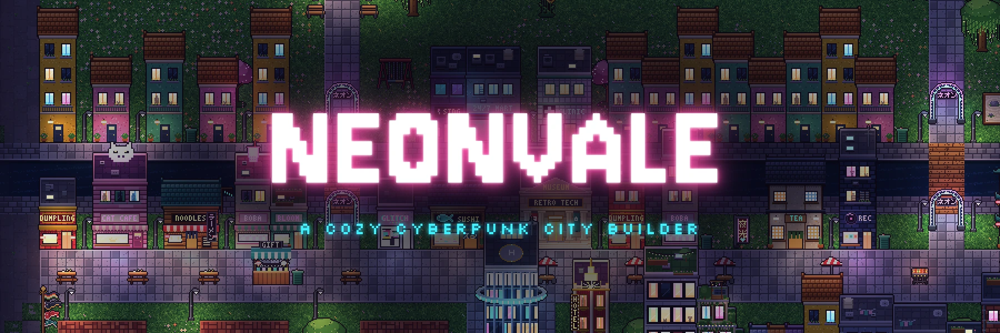</a>
</p>

<p align="center">
  <a href="https://neonvale.dev"></a>
  
  
  
</p>

<h3 align="center">Grow a glowing pixel-art city in the rain.</h3>

<p align="center">Homes, neon shops, stray cats, eighteen neighbours with stories, five districts to found,<br>
and a helper drone who absolutely cannot stop rhyming.<br>
<b>Free in your browser</b> on desktop, phone, tablet and Steam Deck.</p>

<p align="center">
  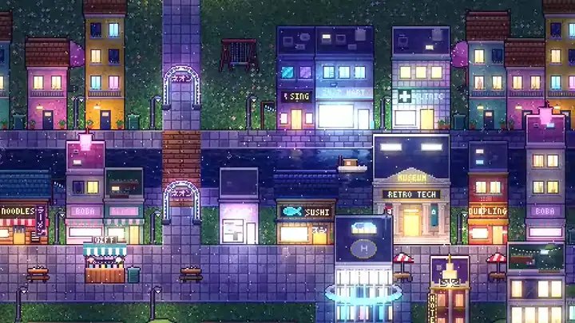
</p>

<p align="center"><a href="https://neonvale.dev"><b>▶ Play now at neonvale.dev</b></a></p>

---

## ✨ Welcome to Neonvale

It's late, it's raining, and the old ward is empty. A few broken landmarks, some junk, a bus stop… and you.

Build a home, and someone steps off the night bus with a suitcase. Build a noodle bar nearby, and they've got
dinner and a job. String up some lanterns, lay a little path to their door, and the street starts to glow.
Before long the ward is a buzzing neon city:
- cafés and arcades and corner marts;
- cats asleep on warm vents;
- neighbours who know your name.

**No timers. No fail states. No pressure.** Just you, the rain and a city coming to life one lantern at a time.

<table>
  <tr>
    <td width="50%">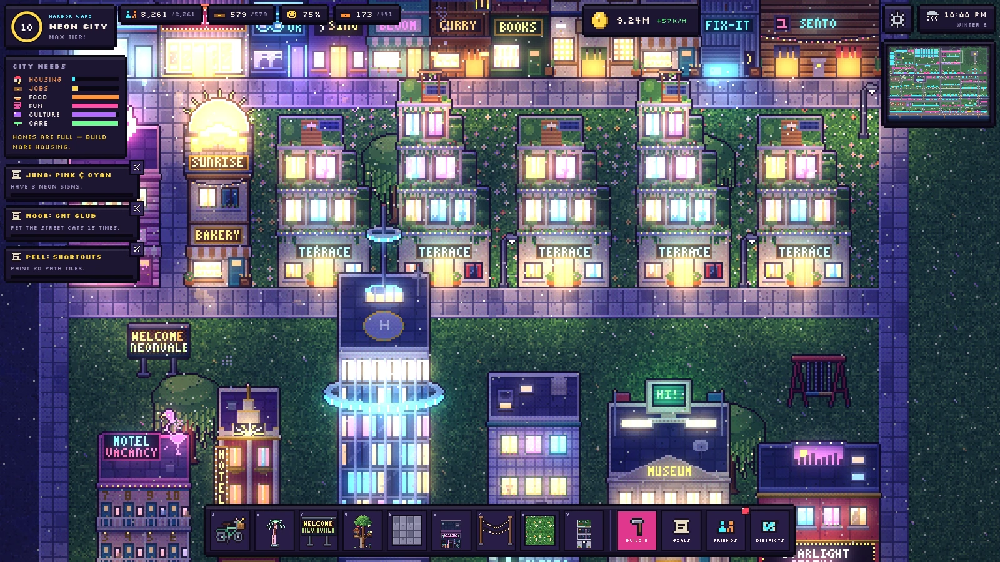</td>
    <td width="50%">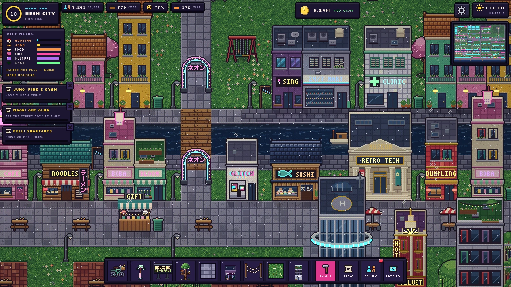</td>
  </tr>
  <tr>
    <td align="center"><sub><b>Night falls and the neon comes on:</b> real light pools, glow and wet-street reflections</sub></td>
    <td align="center"><sub><b>By day,</b> the canal street with its cat café, noodle bar and boba shops</sub></td>
  </tr>
</table>

## 🏙️ How it plays

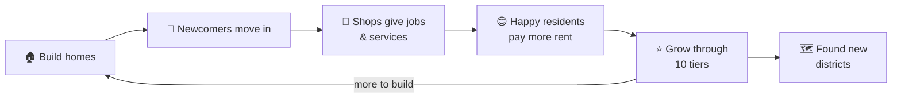

- **Build anything, anywhere.** **243 things to place:**
  - 25 kinds of homes, from sleeping pods to towers, plus 8 hotels;
  - 60 shops, from vending machines and takoyaki stands to clinics, arcades and cinemas;
  - 143 decor pieces: street lamps, neon signs, cherry trees, benches, pigeons, dumpsters and more;
  - landmarks, and 20 kinds of path.
- **Keep everyone happy.** Residents need food, fun, culture and care close to home, plus a cosy street around
  their door. Happy homes pay more rent and attract more neighbours.
- **Grow** from an *Empty Lot* through ten tiers to a full *Neon City* of 640 residents.
- **Restore the old landmarks:** a radio mast, a fountain, the train station and a hill shrine each bring big
  bonuses.
- **Tidy up the ward:** clear ruins and junk for salvage coins.
- **Change your mind freely:** undo and redo every build, move any building, or search the build menu by just
  typing.

<table>
  <tr>
    <td width="50%">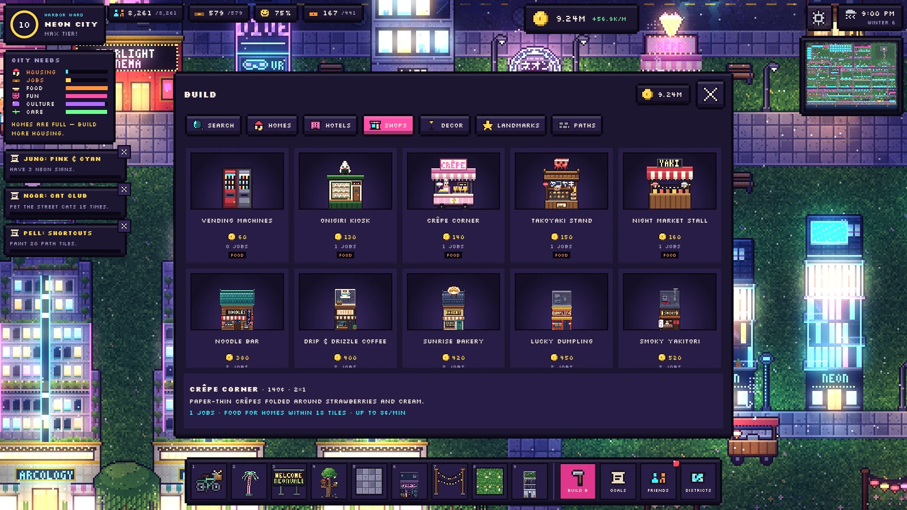</td>
    <td width="50%">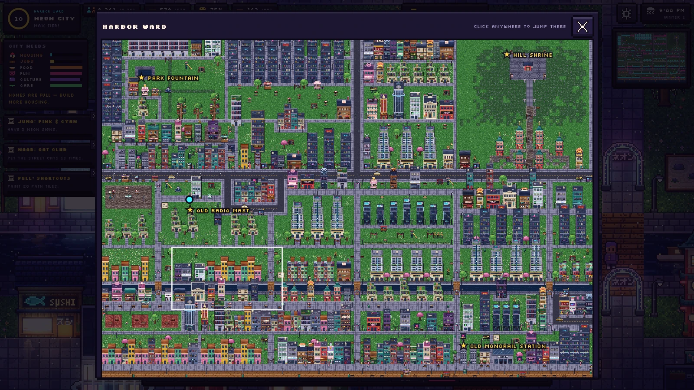</td>
  </tr>
  <tr>
    <td align="center"><sub><b>Hundreds of things to build,</b> each with its own day and night look</sub></td>
    <td align="center"><sub><b>The map</b> is a live miniature of your district: click to jump anywhere</sub></td>
  </tr>
</table>

## 🗺️ Five districts to found

Once your city reaches *Neighbourhood*, a new district opens up past the mist. Found it and start fresh, with your
savings coming along. Travel back any time: the districts you leave keep earning while you're away.

| | District | |
| :-: | --- | --- |
| 1 | **Harbor Ward** | Where it all began: an old avenue, a canal and the harbor. |
| 2 | **Lantern Canals** | A maze of canals and little bridges. Boats drift past your door. |
| 3 | **Sakura Hills** | Terraced slopes, stone steps and a shrine at the summit. |
| 4 | **Old Docklands** | Rusting warehouses and long piers. Lots of salvage, lots of space. |
| 5 | **Neon Heights** | A ready-made street grid waiting for towers. The big city. |

## 💬 Neighbours with stories

Eighteen named residents move in as your city grows:
- **Mika**, a night-shift hacker;
- **Old Taro**, a retired synth musician;
- **Noor**, a ten-year-old cat whisperer;
- **Grandpa Gen**, a retired ferry captain;
- **Madame Lune**, a fortune teller;
- **Kiko**, a retired pop idol;
- **Professor Oda**, a retired astronomer;
- …and **Nana Fumi**, who will knit you a scarf whether you like it or not.

Chat with them, earn their hearts and help with their requests (there are **95 goals and requests** in all). Each
one has a little story to tell, and a gift for good friends.

Your guide through it all is **POET**, a small helper drone who rolls around town like everyone else, and rhymes:

> *"Why POET? I rhyme when I'm happy, I rhyme when I'm blue. I once rhymed so hard that my antenna rhymed too!"*

<table>
  <tr>
    <td width="50%">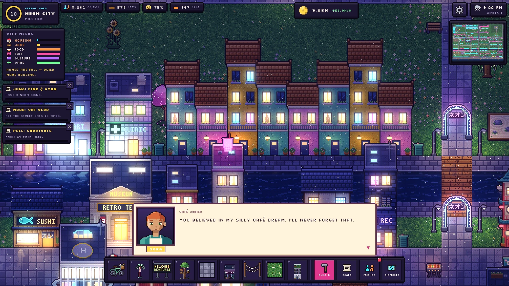</td>
    <td width="50%">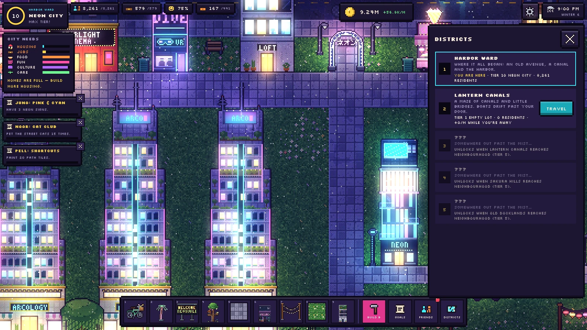</td>
  </tr>
  <tr>
    <td align="center"><sub><b>Sora</b> never forgets who believed in her café</sub></td>
    <td align="center"><sub><b>Hop between districts</b> whenever you like</sub></td>
  </tr>
</table>

## 🌧️ Cozy little details

- 🐈 **Six stray cats** with their own favourite spots. You can pet them.
- 🌦️ **Weather and seasons:** drizzle, downpours, fog, snow in winter and golden evenings.
- 🌙 **A day–night cycle** where every window, sign and street lamp lights up for real after dark.
- ⛵ **Boats on the canals**, buses bringing newcomers, and tourists checking into your hotels.
- 🎵 **An original soundtrack and sound effects**, all made for the game.
- 🖼️ **Posters:** export your whole district as a giant **7680×5760** picture, by day or by night.

<p align="center">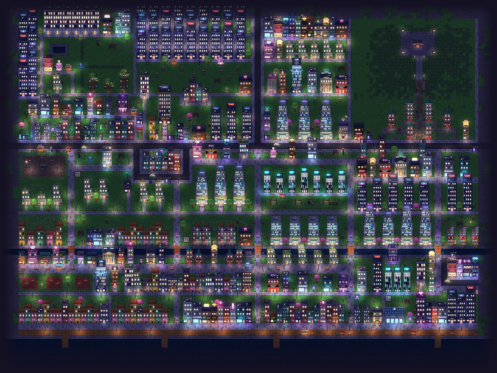</p>

## 🕹️ Play it anywhere

- 🖱️ **Desktop:** mouse and keyboard, with handy shortcuts. Arrow keys nudge what you're placing, and
  <kbd>Ctrl</kbd>+<kbd>Z</kbd> undoes.
- 🎮 **Controller:** the whole game, menus included, works on a gamepad.
- 🚂 **Steam and Steam Deck:** add it to your library as a full-screen game (see below).
- 📱 **Phone and tablet:** a touch layout made for small screens. Tap to place and swipe between build tabs.
- 📲 **Install it:** add Neonvale to your home screen or desktop and it works offline too.

<p align="center">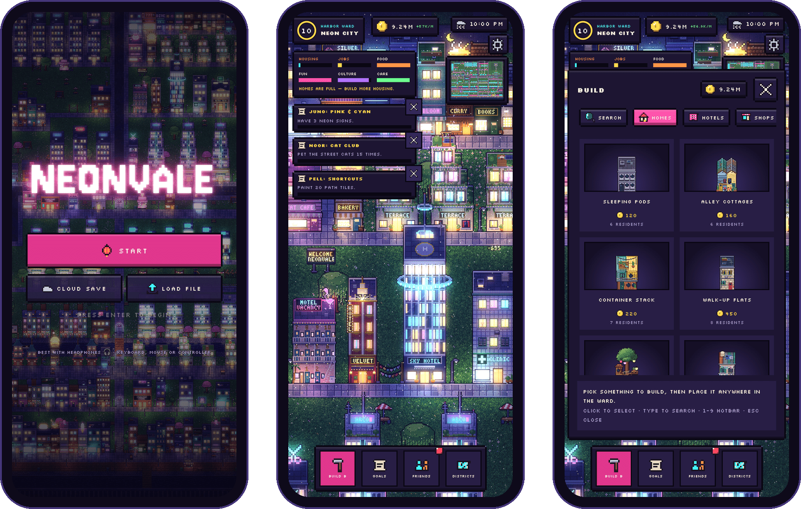</p>

## ☁️ Your city on every device

Start on your PC, carry on from the sofa on your phone or Steam Deck.
- **No account, no email:** Neonvale gives your city a **save code and a 4-digit PIN**. Enter them on any device
  and your city is right there.
- **One device at a time:** if you pick your city up somewhere else, the other device steps back to the title
  screen, so nothing ever gets overwritten.

<p align="center">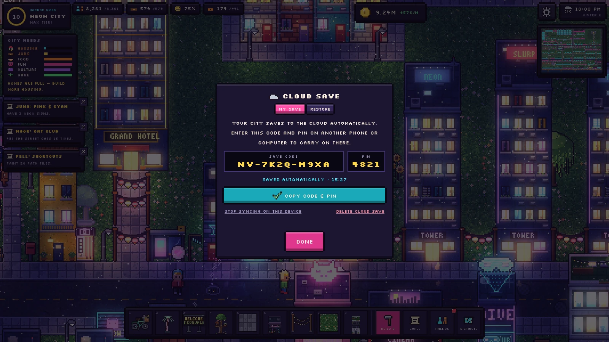</p>

## 🚂 Adding Neonvale to Steam

1. In Steam: **Games → Add a Non-Steam Game to My Library…** and pick **Google Chrome**.
2. In the new shortcut's **Properties**, name it *Neonvale* and set the launch options:

   ```
   --user-data-dir="C:\Games\Neonvale\profile" --kiosk --autoplay-policy=no-user-gesture-required --no-first-run https://neonvale.dev
   ```

   This gives you full screen, sound from the first button press, and a separate window Steam can keep track of.
3. Under **Controller**, choose the **Gamepad** layout. On a Steam Controller or Deck, **Gamepad with Mouse
   Trackpad** works great too.

On **Steam Deck**, add Chrome from Discover first. Then run this once in Konsole so Chrome can see the controls:

```
flatpak --user override --filesystem=/run/udev:ro com.google.Chrome
```

<details>
<summary><b>⌨️ Controls</b></summary>

| Action | Keyboard / mouse | Controller |
| --- | --- | --- |
| Look around | Arrow keys or drag the map (Shift = faster) | Left stick |
| Inspect, talk, pet, clear | Click it | Aim + A |
| Build menu | B (just type to search) | X |
| Place · nudge | Click or Enter · arrow keys | A · D-pad |
| Selected building | Arrows to move · U upgrade · Delete remove | — |
| Paint paths | Click-drag | Hold A + move |
| Undo / redo | Ctrl+Z / Ctrl+R | — |
| Goals · Friends · Districts | G · F · D | Y, then LB / RB |
| Map | M | View |
| Zoom | Mouse wheel or + / − | LT / RT |
| Menu | Esc | Start |

</details>

## ❓ FAQ

<details>
<summary><b>Is it really free?</b></summary>

Yes. Open <a href="https://neonvale.dev">neonvale.dev</a> and play. No ads, no account, no download.
</details>

<details>
<summary><b>Which browsers does it run in?</b></summary>

Any modern browser with WebGL2: Chrome, Edge, Firefox and Safari, on desktop and mobile.
</details>

<details>
<summary><b>Where is my city saved?</b></summary>

In your browser, automatically. To play on more than one device (or just to keep a backup), turn on **Cloud save**
in the menu. You can also export a save file any time.
</details>

<details>
<summary><b>Does it work offline?</b></summary>

Yes. Once you've loaded it (or installed it to your home screen or desktop), it plays without a connection.
Cloud saves catch up when you're back online.
</details>

<details>
<summary><b>Is the game open source?</b></summary>

No, the source code is private. This page is the game's public home for news, screenshots and feedback.
</details>

## 💌 Feedback

Found a bug, have an idea, or just want to show off your city? **[Open an issue](../../issues)**. Screenshots and
posters very welcome!

<p align="center">
  <a href="https://neonvale.dev"></a>
</p>

<p align="center"><sub>Made with neon, rain and a lot of tiny pixels.<br>
Fonts: <a href="https://fonts.google.com/specimen/Jersey+10">Jersey 10</a>, <a href="https://fonts.google.com/specimen/Silkscreen">Silkscreen</a> and <a href="https://fonts.google.com/specimen/Handjet">Handjet</a> (SIL Open Font License).</sub></p>
